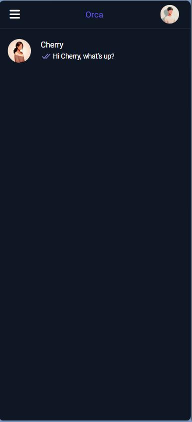
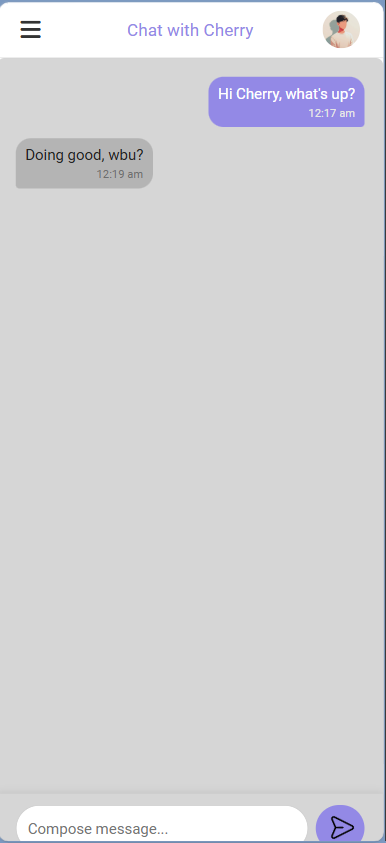
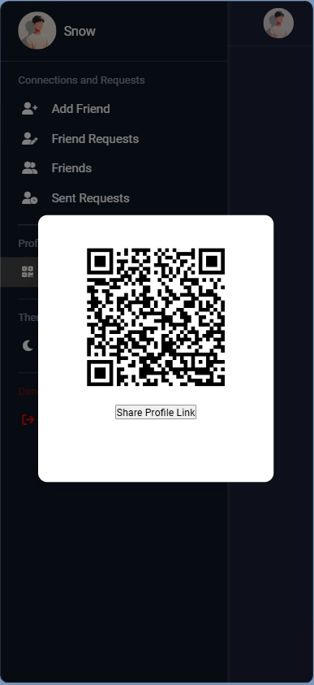
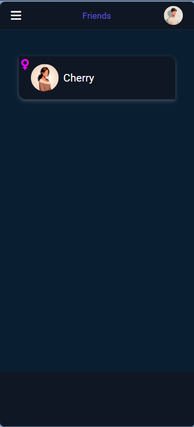

# Orca (orca2echo)

<p align="center">
  A real-time web-based chat application built with <strong>Django</strong>, <strong>Django Channels</strong>, <strong>Redis</strong>, and <strong>MongoDB</strong>.
</p>

<p align="center">
  
</p>

---

## Features

| Feature | Description |
|---|---|
| **Real-time Messaging** | Instant messaging powered by WebSockets via Django Channels and Redis |
| **Friend System** | Send, accept, decline, and cancel friend requests effortlessly |
| **OTP Authentication** | Secure passwordless login system using One-Time Passwords sent via email |
| **Profile Sharing** | Generate and share your profile using automatically generated QR codes and encrypted links |
| **Dark / Light Mode** | Toggle between beautiful, responsive light and dark themes |
| **Secure Link Encryption** | Profile URLs are secured using AES symmetric encryption (`Fernet`) |
| **Non-blocking Architecture** | Fully asynchronous WebSocket logging and communication |

---

## Screenshots

### Live Chat Room

<p align="center">
  
</p>

Real-time chat interface featuring instant message delivery, timestamps, and active status.

---

### Add Friends & Share Profile

<p align="center">
  
</p>

Easily connect with others using encrypted QR codes or direct profile links.

---

### Friend List & Requests

<p align="center">
  
</p>

Manage your connections, view active friends, and handle incoming requests on the fly.

---

## Tech Stack

| Layer | Technology |
|-------|-----------|
| Frontend | HTML, CSS, JavaScript |
| Backend | Python, Django, Django Channels (WebSockets) |
| Database | MongoDB (via PyMongo wrapper) |
| In-Memory Store | Redis (for Channels Layer) |
| Security | `cryptography.fernet` (Symmetric encryption) |

---

## Folder Structure

```
.
├── orca/                    # Django core project folder
│   ├── settings.py          # Application settings (logging, channels, DB)
│   ├── asgi.py              # ASGI config for Channels
│   └── wsgi.py              # WSGI config for HTTP
├── orca2echo/               # Main application
│   ├── forms.py             # Django forms for validation (Signin, Signup)
│   ├── models.py            # MongoDB Document models & Django Users
│   ├── views.py             # HTTP route handlers
│   ├── consumers.py         # WebSocket Chat consumer
│   ├── routing.py           # WebSocket routing configuration
│   ├── services/            # Extracted business logic
│   │   ├── auth_service.py  # Encryption, QR generation, OTP
│   │   └── mongo_service.py # PyMongo wrappers
│   ├── static/              # CSS, JS, and image assets
│   └── templates/           # Django HTML templates
├── .env                     # Environment variables (not tracked)
├── requirements.txt         # Python dependencies
└── README.md                # Project documentation
```

---

## Getting Started

### Prerequisites

- Python 3.10+
- MongoDB instance (local or Atlas)
- Redis server (local or Docker)

### Installation

1. Clone the repository and navigate into it:

   ```bash
   git clone <repository-url>
   cd orca
   ```

2. Create a virtual environment and install dependencies:

   ```bash
   python -m venv venv
   source venv/bin/activate  # On Windows: venv\Scripts\activate
   pip install -r requirements.txt
   ```

3. Ensure Redis is running on your machine:
   ```bash
   sudo apt install redis-server
   sudo systemctl enable redis-server
   sudo systemctl start redis-server
   ```

4. Create a `.env` file in the root directory based on your environment:

   ```env
   SECRET_KEY=your-django-secret-key
   MONGODB_URL=your-mongodb-connection-string
   EMAIL_HOST_USER=your-email@example.com
   EMAIL_HOST_PASSWORD=your-app-password
   VAPID_PRIVATE_KEY=your-vapid-private-key
   VAPID_PUBLIC_KEY=your-vapid-public-key
   ```

### Running the Application

Because this app utilizes WebSockets, it should be run using an ASGI server like Uvicorn or Daphne.

```bash
uvicorn orca.asgi:application --reload --host 127.0.0.1 --port 8000
```

The application will now be accessible at `http://127.0.0.1:8000/`.

---

## Available Scripts

| Command | Description |
|--------|-------------|
| `python manage.py runserver` | Run basic Django HTTP server (No WebSocket support) |
| `uvicorn orca.asgi:application --reload --host 127.0.0.1 --port 8000` | Run ASGI server with WebSocket support |
| `python manage.py collectstatic` | Collect static files for production |

---

## Environment Variables

| Variable | Required | Description |
|----------|----------|-------------|
| `SECRET_KEY` | Yes | Django secret key (used for cryptography and sessions) |
| `MONGODB_URL` | Yes | MongoDB connection URI |
| `EMAIL_HOST_USER` | Yes | Email address for sending OTPs |
| `EMAIL_HOST_PASSWORD` | Yes | SMTP app password for email dispatch |
| `VAPID_PUBLIC_KEY` | No | Public key for push notifications |
| `VAPID_PRIVATE_KEY` | No | Private key for push notifications |
